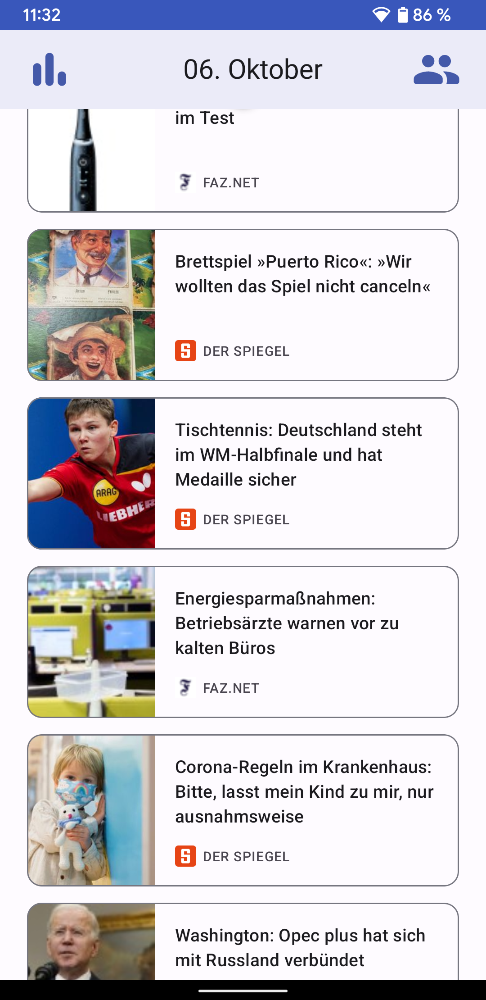
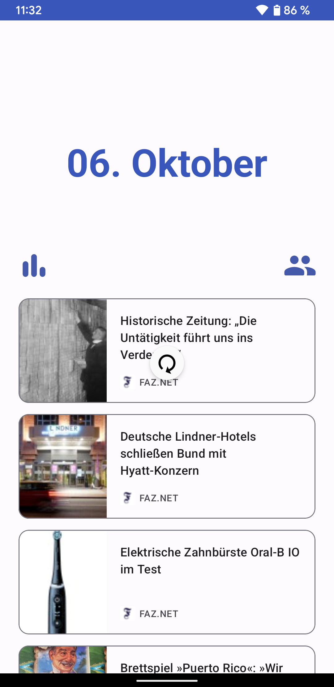
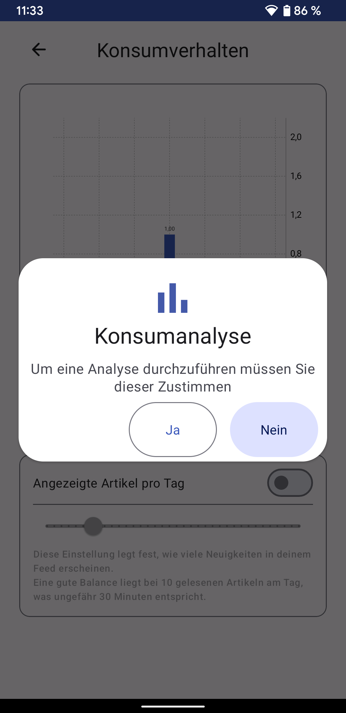
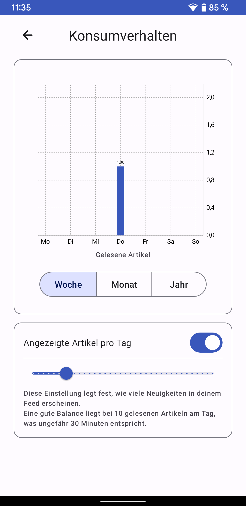
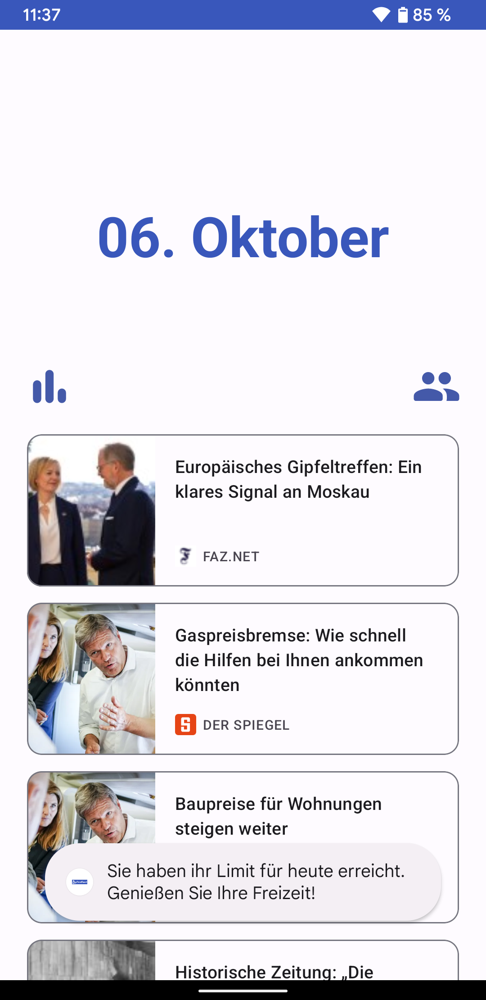
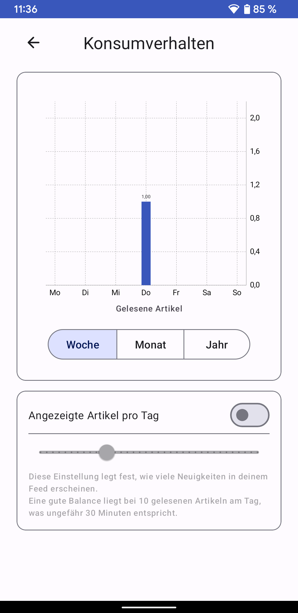

# OneFeed

## Target Group

> Everyone who consumes content on the internet.

Neuropsychologists such as Lutz Jäncke report that the users brain is overwhelmed by the flood of information on the Internet, and thus loses the ability to distinguish between qualitative and quantitative content. Therefore, OneFeed should make it possible to consume all kinds of written media on the Internet through one channel and thus also to control it in order to prevent the brain from being overwhelmed.

## End result of the project

The app allows you to pre-select news portals on your own. You have the option of specifying your interests, and your consumption is tracked and blocked if you have activated the blocking function in the app.

The app does not offer the option of adding an RSS feed independently, as these XML files are always structured differently.

The app does not include its own reader, as we are unable to download the texts from news portals for legal reasons. Instead, an in-app browser window is being launched.

## Further Hints

- To test the app, you will need a Twitter account to log in with during the onboarding process. 
- To install the app, you need a mobile phone with at least Android Q.
- The app has been programmed for use on a smartphone

---

 # Showcase

## Feed

The feed is the main component of the app. From all configured sources, a single feed is being created. In the first version of OneFeed, it contains news from Spiegel, FAZ and Twitter. Scrolling the feed causes the title bar to collapse.

  
  

Clicking on an article opens a reader or the Twitter app (if installed).

Pulling on the feed causes it to refresh.

## Insight View

The insight can be enabled by the user. If it is disabled, the user will be asked to enable it upon opening the view.

When enabled, OneFeed counts the articles and Tweets opened by the user in the reader. In the insight view a graph is displaying how many articles a user read each day to give the user transparency about their own news consumption.

Users can also limit the amount of articles they can open in the reader each day. If the user has reacher the daily limit, a toast notification is displayed in the feed and articles can't be opened in the reader.

The insight feature can be disabled by toggling the checkbox next to "Angezeigte Artikel pro Tag". This stops the counting and users have to opt in to the feature again.

